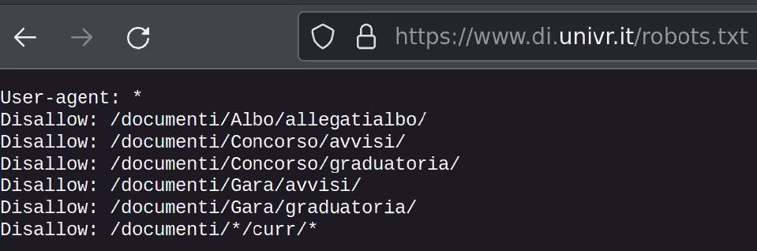
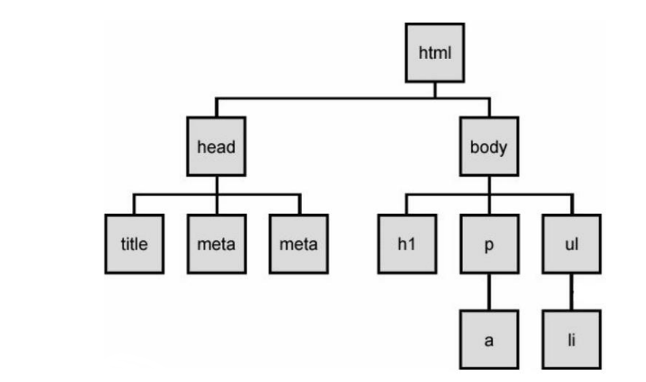

# Lezione 11 Python

## Web scraping

Un *web scraper* è un programma che scarica contenuto (in genere testi scritti in
linguaggio naturale o html) da una o più pagine web per esternare dati.

In genere un scraper si interfaccia con lo strato "esterno" di un sito web, quindi
con le informazioni normalmente disponibili agli utenti. 

Il web scraping non è illegale, ma alcuni suoi utilizzi possono esserlo. Ad esempio,
il *Garante della Privacy* ne vieta l'uso per la raccolta di dati personali senza 
consenso.

### Limitazioni al web scraping
Si stima che più del 50% del traffico sull'internet sia composto da bot. <br>
Molti siti web forniscono un file, robots.txt, che presenta permessi e limitazioni. <br>

È bene cercare di limitare il numero di richieste al secondo (per evitare congestioni) e
di avvisare sempre il gestore del sito su cui si vuole fare scraping.

*Esempio di robots.txt [univr](https://www.di.univr.it/robots.txt)*:


### Alcuni cenni di HTML
HTML è un linguaggio di markup. Serve a strutturare documenti ipertestuali, in genere
pagine web. È possibile pensarel al codice come ad un albero, in cui ogni nodo è un 
tag. I tag sono racchiusi fra le parentesi angolari `<>`, e possono anche avere attributi.

*Esempio:*
```html
<html>
<head>
    <title>My First Web Page</title>
</head>

<body>
    <h1>My First Web Page</h1>
    <p><b>Hello World Wide Web!</b></p>
    <p><i>Hello World Wide Web!</i></p>
    <p><u>Hello World Wide Web!</u></P>
    <p>This is my first web page.</p>
    <p>HTML tags can give <b><i>various</i></b>
    <u>looks and format</u> to the content of this
    web page.
</body>

</html>
```
*Esempio:*


## Beautiful soup - Web scraping in python

Beautifoul soup è una libreria molto popolare per fare scraping su documenti HTML 
(o XML). <br>
Supporta diversi parser e fornisce un'interfaccia user friendly per navigare, 
modificare e fare ricerche nell'albero ottenuto dal parsing del documento.

Documentazione: [beautifulsoup](https://beautiful-soup-4.readthedocs.io/en/latest/)

**NB:** usare esplicitamente beautifulsoup 4, `python3 -m pip install beautifulsoup4`.

Non è l'unico strumento di questo tipo, per approfondire:
+ [Scrappy](https://scrapy.org/) è una libreria più a basso livello (e potenzialmente più performante) 
di beautifulsoup.
+ [Selenium](https://www.selenium.dev/) è utile per gestire pagine che usano molto codice javascript.

### Requests

Beautifulsoup non si occupa di "catturare" pagine web ma solo di analizzarle.

In python, è possibile usare la liberaria `requests` per scaricare il codice di interesse.
```Python
import requests

req = requests.get('https://www.google.com')
# Stampa dei primi 500 caratteri
print(req.text[:500])
```
*Output:*
```
<!doctype html><html itemscope="" itemtype="http://schema.org/WebPage" lang="it"><head><meta content="te
xt/html; charset=UTF-8" http-equiv="Content-Type"><meta content="/images/branding/googleg/1x/googleg_sta
ndard_color_128dp.png" itemprop="image"><title>Google</title><script nonce="0v-0e879qCjksys-4MjeZQ">(fun
ction(){window.google={kEI:'ySWCYr3aD4WGxc8Pm9CZiAU',kEXPI:'0,1302536,56873,6059,206,4804,2316,383,246,5
,1354,4013,1238,1122515,1197723,678,380090,16114,28684,17572,4859,1361,284,12032,474'}})
```
*È importante verificare il `robots.txt` prima di scaricare dati.*

### Da HTML a soup

È possibile creare una "zuppa" (il nome deriva da [tag soup](https://en.wikipedia.org/wiki/Tag_soup))
partendo da una stringa (nel caso preso in esempio, la pagina raccolta con `requests`).

I quattro parser supportati di default sono:
- 'html.parser': default. Veloce, ottimo per documenti semplici. Ha più problemi
a gestire file mal formattati.
- 'html5lib': molto più lento, ma estremamente indulgente. Ottimo per gestire file
complessi, a patto che la velocità non sia un problema.
- 'xml': solo per file XML.
- 'lxml': supporta XML e HTML, veloce e indulgente con gli errori.

*Esempio*:
```Python
import bs4 as bs # beautifulsoup

# uso html.parser come parser
soup = bs.BeautifulSoup(req.text, "html.parser")
print(type(soup))
```
*Output*:
```
<class 'bs4.BeautifulSoup'>
```
```Python
# parser alternativo: html5lib
soup = bs.BeautifulSoup(req.text, "html5lib")
print(type(soup))
```
*Output*:
```
<class 'bs4.BeautifulSoup'>
```
