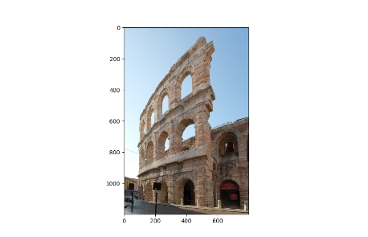
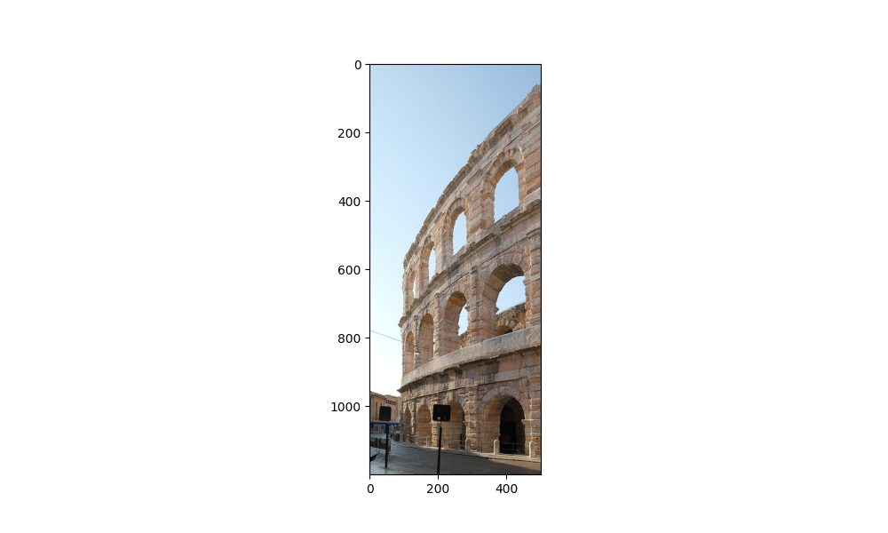
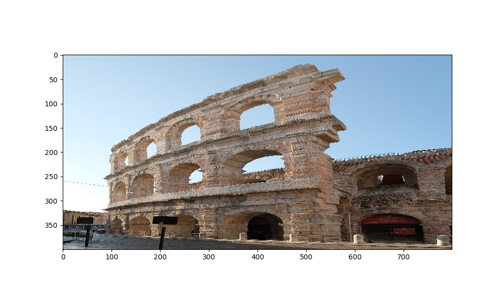
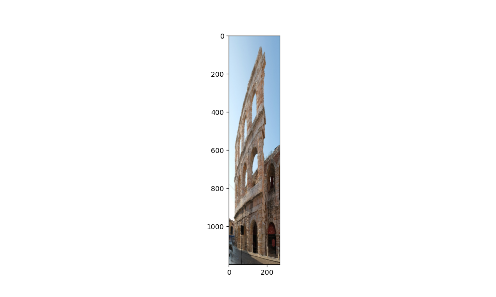
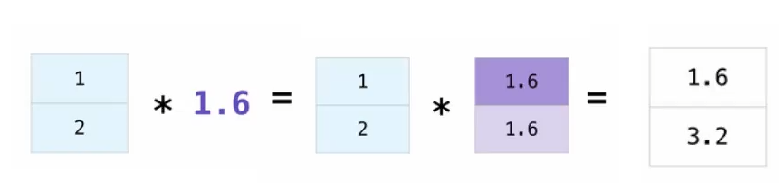
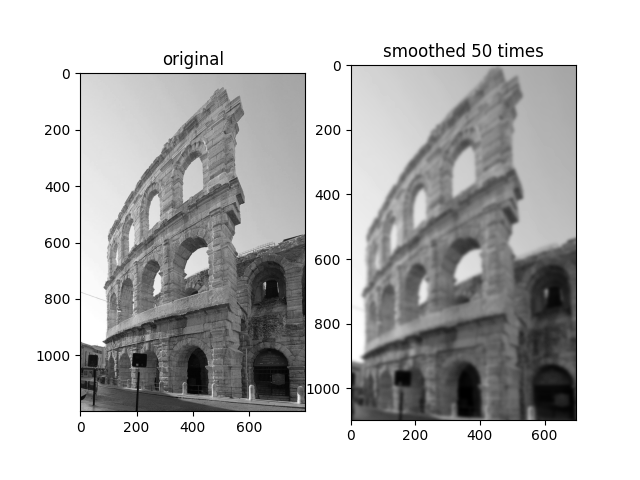

# Lezione 8 Python

## Moduli

Python è un linguaggio "battery included", ovvero viene fornito insieme a una ricca raccolta
di **pacchetti e moduli**: librerie software che possono essere importate per facilitare il lavoro.

In genere, si usa `import` per importare un modulo, ma esistono delle varianti.

Un pacchetto è una raccolta di moduli. Si può pensare al pacchetto come ad una cartella, e ai suoi
moduli come ai file contenuti nella cartella (anche se non è sempre cosi).

*Esempio*:
```Python
# importa il modulo
import math
# devo esplicitare il modulo
print(math.p1)

# importa solo un elemento
from math import pi
# posso usare l'elemento importato direttamente
print(pi)

# m è un alias di math
import math as m
print(m.pi)
```
*Output*:
```
3.141592653589793
3.141592653589793
3.141592653589793
```
*Un modo ulteriore per importare, ma è sconsigliato, è quello di importare tutto
il contenuto di una libreria*:
```Python
from math import *
```

### Creare un modulo

Un modulo è un semplice file python. Può essere importato usando il suo nome ed
omettendo l'estensione `.py`.

*Esempio*:
File `my_module.py`

```Python
def somma_1(x):
    return x + 1
```
File `main.py`
```Python
import my_module

print(my_module.somma_1(5))
```
*Output*:

```
6
```
Il modulo creato deve essere nella stessa cartella del file all'interno del quale
viene importato.

### Main

È Possibile definire un `main` del modulo, usando
```Python
if __name__ == '__main__'
```
ovvero una sezione di codice che viene eseguita solo se il codice viene usato direttamente.

Se il modulo viene importato, il codice in 'main' non viene eseguito.

*Aggiungiamo un main al file `my_module.py`*

```Python
def somma_1(x):
    return x + 1

def main():
    print('ciao')
    print(somma_1(41))

if __name__ == '__main__':
    main()
```

In questo caso se eseguo lo script direttamente chiamando l'interpreter sul file `my_module.py`
ottengo come output:
```
python3 my_module.python
ciao
42
```
Mentre se importo il file in un nuovo scritp, ad esempio `test.py`:
```Python
import my_module

print(my_module.somma_1(41))
```
La chiamata della funzione di `my_module` non fa eseguire il `main()`:
```
python3 test.py
42
```

## Ambienti virtuali - venv

È facile installare una libreria, ma in genere si vuole tenere il progetto separato dal resto 
del sistema. Questo ha diversi benefici:

+ È possibile specificare esattamente la versione di python da usare
+ È possibile usare una versione specifica di una libreria (diversa per ogni progetto)
+ È possibile rendere il nostro ambiente di lavoro facilmente riproducibile da altri

Questa cosa è possibile ottenerla crando un **ambiente virtuale**, una "bolla" che separa
il nostro progetto dal resto del sistea.

Python offre un ambiente virtuale di default, **venv**, ma ce ne sono altri (virtualenv, conda, ...)

Documentazione: [venv](https://docs.python.org/3/library/venv.html)

#### Creare un virtual environment su linux

```
python3 -m venv <nome_ambiente>

```
Dopo la creazione dell'ambiente apparirà una nuova cartella `<nome_ambiente>`, che al 
suo interno conterrà una serie di file e cartelle.
```
bin  include  lib  lib64  pyvenv.cfg  share
```
Per **attivare** l'ambiente devo usare il comando
```
source bin/activate
```
A questo punto l'ambiente è attivo e all'inizio della riga di comando sarà presente
il nome dell'ambiente.
```
(nome_ambiente) jarvis@JARVIS:pts/2─(18:06:06 on main ✹ ✭)──> 
```

#### Package manager pip

Utilizzando il comando `python -m pip install <nome_pacchetto>` è possibile installare
pacchetti, se questo comando viene eseguito all'interno del venv creato, automaticamente
saranno installati i pacchetti inerenti alla versione di python corrispondente al venv.

Per rendere l'ambiente facilmente riproducibile è possibile usare il comando
`python -m pip freeze > requirements.txt`, in questo modo tutte le librerie installate
nel venv creato, vengono salvate in un file di testo ed è possibile ricreare in seguito 
l'ambiente usando il comando `python -m pip install -r requirements.txt`.

## NumPy - Numerical Python

Il primo modulo che vedremo è **NumPy**, serve per svolgere computazioni numeriche pesanti.

Questo pacchetto fa da base a molte librerie scientifiche del Python, è quindi importante 
conoscerne i principali elementi. 

NumPy offre la struttura dato "array", che può essere usata per rappresentare array ad
n dimensioni.

Offre inoltre diverse operazioni vettorizzate (i.e., estremamente efficienti). Il codice
è implementato in **C**.

Documentazione: [NumPy](https://numpy.org/doc/stable/)

### NumPy array

A differenza delle liste Python, in NumPy tutti gli elementi di un array devono avere lo
stesso tipo. Quando vengono dichiarati, va fornita una forma (shape) che viene usata da 
numpy per allocare in maniera efficiente i dati.

```Python
import numpy as np

# array di 10 elementi posti a zero
v = np.zeros(10)
print(v)
print(type(v), v.dtype, v.shape)
```
*Output*:
```
[0. 0. 0. 0. 0. 0. 0. 0. 0. 0.]
<class 'numpy.ndarray'> float64 (10, )
```
L'attributo *shape* definisce la "forma" dell'array (numero di righe, colonne ecc...).

Nel caso bidimensionale, il primo parametro è il numero di righe, il secondo quello di colonne.

Da notare che *shape* è sempre restituita come **tupla**.

È possibile modificare la 'shape' con il metodo `reshape` (o con altri metodi specifici, <br>
come T per la trasposta).

*Esempio*:
```Python
v = np.zeros((2, 10))
print(v)
```
*Output*:
```
[[0. 0. 0. 0. 0. 0. 0. 0. 0. 0.]
 [0. 0. 0. 0. 0. 0. 0. 0. 0. 0.]]
```
```Python
print(v.T)
print(v.shape, v.T.shape)
```
*Output*:
```
[[0. 0.]
 [0. 0.]
 [0. 0.]
 [0. 0.]
 [0. 0.]
 [0. 0.]
 [0. 0.]
 [0. 0.]
 [0. 0.]
 [0. 0.]]
(2, 10) (10, 2)
```
```Python
print(v.reshape((1, 20)))
```
*Output*:
```
[[0. 0. 0. 0. 0. 0. 0. 0. 0. 0. 0. 0. 0. 0. 0. 0. 0. 0. 0. 0.]]
```

**IMPORTANTE**: i metodi 'T' e 'reshape' non modificano in memoria il dato, ma lo leggono<br>
in modo diverso, quindi il costo dell'operazione di trasposta, per esempio, e' ottimizzato.

### Accesso

In caso di array multidimensionali (matrici), possiamo accedere a un elemento **mettendo tutti gli 
indici dentro alle parentesi quadre**.

```Python
a = np.arange(25).reshape((5, 5))
print(a)
print(a[0, 0]) # riga 0 colonna 0
print(ap2, 3)) # riga 2 colonna 3
```
*Output*:
```
[[ 0  1  2  3  4]
 [ 5  6  7  8  9]
 [10 11 12 13 14]
 [15 16 17 18 19]
 [20 21 22 23 24]]
0
13
```
*È possibile anche passare liste di posizioni, questo crea un array compattato con i valori <br>
desiderati*:
```Python
# non molto usato
print(a[[0, 2], [0, 3]])
```
*Output*:
```
[ 0 13]
```

### Slice

È possibile usare le stesse operazioni di slice (già viste per le liste) anche in un <br>
array NumPy.

**Attenzione:** NumPy ritorna delle "viste" degli stessi dati, non crea copie con `slice`. <br>
Se si desidera creare una copia, bisogna utilizzare il metodo `copy()`.

*Esempio: <br>
Si vuole prendere dalla matrice `a` precedentemente dichiarata solo la prima riga e tutte le colonne*.
```Python
print(a)
print(a[1:2, :])
```
*Output*:
```
[[ 0  1  2  3  4]
 [ 5  6  7  8  9]
 [10 11 12 13 14]
 [15 16 17 18 19]
 [20 21 22 23 24]]

[[5 6 7 8 9]]
```
È possibile definire anche un 'passo', e con `-1` si inverte la riga/colonna:
```Python
# legge tutte le righe dalla fine all'inizio, e solo le prime 3 colonne (0, 1, 2).
print(a[::-1, :3])
```
*Output*:
```
[[20 21 22]
 [15 16 17]
 [10 11 12]
 [ 5  6  7 ]
 [ 0  1  2 ]]
```

Esempio utilizzando un immagine, che è un'array di pixel, ovvero un array a 3 dimensioni.

```Python
import matplotlib.pyplot as plt
plt.rcParams['figure.figsize'] = [10, 6]

img = plt.imread('arena.png')
plt.imshow(img)
plt.show()
print(type(img))
```
*Output*:

```
<class 'numpy.ndarray'>
```
Ecco alcuni esempi di slicing:
```Python
import matplotlib.pyplot as plt
plt.rcParams['figure.figsize'] = [10, 6]

img = plt.imread('arena.png')
plt.imshow(img[:500, :]) # sliced_1.png 
plt.show()
print(type(img))
```

*sliced_1.png*
```Python
import matplotlib.pyplot as plt
plt.rcParams['figure.figsize'] = [10, 6]

img = plt.imread('arena.png')
plt.imshow(img[:, :500]) # sliced_2.png
plt.show()
print(type(img))
```

*sliced_2.png*
```Python
import matplotlib.pyplot as plt
plt.rcParams['figure.figsize'] = [10, 6]

img = plt.imread('arena.png')
plt.imshow(img[::3, :]) # compressed_1.png
plt.show()
print(type(img))
```

*compressed_1.png*
```Python
import matplotlib.pyplot as plt
plt.rcParams['figure.figsize'] = [10, 6]

img = plt.imread('arena.png')
plt.imshow(img[:, ::3]) # compressed_2.png
plt.show()
print(type(img))
```

*compressed_2.png*

## Vecotized operations

Applicare un'operazione matematica tra due vettori applica lo stesso operatore elemento per
elemento. Questo è implementato in maniera estremamente efficiente.

*Esempio*:
```Python
import numpy as np

a = np.array([1.0, 2.3, 7, 2.999])
b = np.array([3.2, 1.0, 1, 1.2])

print(a + b)
print(a * b)
print(a / b)
print(a ** b)
print(a * 10)
```
*Output*:
```
[4.2   3.3   8.    4.199]
[3.2    2.3    7.     3.5988]
[0.3125     2.3        7.         2.49916667]
[1.         2.3        7.         3.73569799]
[10.   23.   70.   29.99]
```

Per lavorare con i vettori in modo efficiente è necessario usare i metodi messi a disposizione. Utilizzare
dei cicli `for`, come si fa in altri linguaggi di programmazione (C, Java, ...) rende molto inefficiente le 
operazioni.

*Esempio*:
*Data una matrice, si vuole il seno di tutti gli elmenti*
```Python
m = np.arange(25).reshape(5, 5)
sin_m = np.sin(m)
print(sin_m)
```
*Output*:
```
[[ 0.          0.84147098  0.90929743  0.14112001 -0.7568025 ]
 [-0.95892427 -0.2794155   0.6569866   0.98935825  0.41211849]
 [-0.54402111 -0.99999021 -0.53657292  0.42016704  0.99060736]
 [ 0.65028784 -0.28790332 -0.96139749 -0.75098725  0.14987721]
 [ 0.91294525  0.83665564 -0.00885131 -0.8462204  -0.90557836]]
```

In caso di numerosi set di dati, si potrebbe incorrere in operazioni illegali, ad esempio una divisione per
zero. In questo caso l'operazione viene comunque completata, ma python lancia un warning, e nel risultato
vengono messi dei valori, nel caso preso in esempio 'Inf' per indicare infinito.
*Esempio*:
```Python
a = np.array([1.0, 2.3, 7, -2])
b = np.array([3.2, 1.0, 0, 0.5]) # dividiamo per 0

print(a / b)
```
*Output*:
```
<stdin>:1: RuntimeWarning: divide by zero encountered in true_divide
[ 0.3125  2.3        inf -4.     ]
```
*Un altro caso che si può prendere in considerazione è quello in cui viene restituito NaN (Not a Number)*:
```Python
a = np.array([1.0, 3.2, 0, -2])
c = np.array([3.2, 1.0, 0, 0.5])

print(a / b)
print(a ** b)
```
*Output*:
```
<stdin>:1: RuntimeWarning: invalid value encountered in true_divide
[ 0.3125  3.2        nan -4.     ]
<stdin>:1: RuntimeWarning: invalid value encountered in power
[1.  3.2 1.  nan]
```
Nel caso in cui la dimensione dei due array non sia compatibile, non viene eseguita nessuna operazione, 
ma viene lanciata un'eccezione:
```Python
a = np.array([1.0, 3.2, 0, -2])
d = np.array([3.2, 1.0, 0]) # questo array ha un elemento in meno!
print(a / d)
```
*Output*:
```
Traceback (most recent call last):
  File "<stdin>", line 1, in <module>
ValueError: operands could not be broadcast together with shapes (4,) (3,)
```

### Broadcasting

È possibile applicare operazioni elemento-per-elemento anche in (alcuni) contesti in cui le
dimensioni non combaciano. NumPy colma la differenza ripetendo il dato originale più volte.

Questa operazione si chiama **broadcasting**.


*Esempio*:
```Python
a = np.arange(25).reshape(5, 5)
b = np.array(10, 20, 30, 40, 50)
print(a + b)
```
*Output*:
```
[[10 21 32 43 54]
 [15 26 37 48 59]
 [20 31 42 53 64]
 [25 36 47 58 69]
 [30 41 52 63 74]]
```

### Fancy indexing o Boolean indexing

Esiste un metodo alternativo di usare gli indici, noto come **fancy indexing**.

Usa degli array Booleani per selezionare solo gli elementi d'interesse. Si può creare usando
operatori di confronto con l'array.

*Esempio*:
```Python
a = np.array([-1, -3, 1, 4, -6, 9, 3])
mask = a < 0
print(a[mask])

div3 = a % 3 == 0
print(a[div3])

print(a[a.nonzero()])
```
*Output*:
```
[-1 -3 -6]
[-3 -6  9  3]i
[-1 -3  1  4 -6  9  3]
```
Queste maschere possono essere usate, inserendole in liste all'interno degli indici per ottenere
determinati valori.

### Esercizio

Considerando un'immagine applichiamo un algoritmo che la sfuoca.
```Python
import numpy as np
import matplotlib.pyplot as plt

# Utilizzando le operazioni vettoriali
def smooth(img):
    avg_img = (   img[1:-1, 1:-1] # center
                + img[ :-2, 1:-1 ] # top
                + img[2:  , 1:-1] # bottom
                + img[1:-1,  :-2] # left
                + img[1:-1, 2:  ] # right
                ) / 5.0

    return avg_img

# Utilizzando cicli for innestati
def smooth_loop(img):
    smoothed = np.zeros((img.shape[0]-2, img.shape[1]-2))
    for r in range(0, img.shape[0]-2):
        for c in range(0, img.shape[1]-2):
            smoothed[r, c] = (   img[r+1, c+1] # center
                               + img[r  , c+1] # top
                               + img[r+2, c+1] # bottom
                               + img[r+1, c  ] # left
                               + img[r+1, c+2] # right
                               ) / 5.0

    return smoothed

img = plt.imread('arena_bw.png')
plt.figure()
# Set colormap so that images are pltted in gray scale.
plt.gray()
# Plot the original image first
plt.subplot(1,2,1)
plt.imshow(img)
plt.title('original')

avg_img = smooth(img)
for num in range(50):
    avg_img = smooth(avg_img)
    
# Now the filtered image.
plt.subplot(1, 2, 2)
plt.imshow(avg_img)
plt.title('smoothed 50 times')

assert np.allclose(smooth(img), smooth_loop(img))
plt.show()

```
*Output*:


Utilizzare le operazioni vettorizzate migliora le prestazioni di circa 1000 volte 
rispetto alla funzione con i cicli for innestati.
